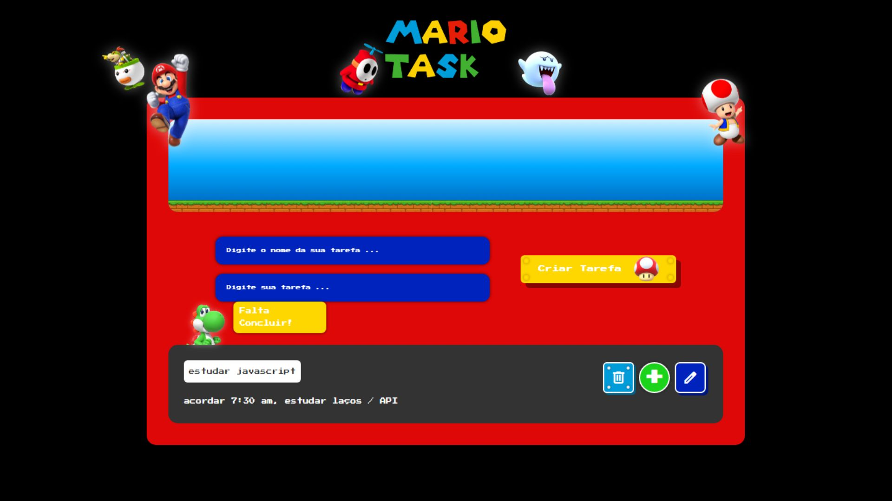

# 🧱 Mario Task 🎮

Um projeto de lista de tarefas com visual retrô e tema do Super Mario, criado com HTML, CSS e JavaScript. Este projeto também funciona como um PWA (Progressive Web App), podendo ser instalado no seu dispositivo móvel ou desktop!



## 🚀 Funcionalidades

- ✅ Adicionar tarefas com nome personalizado
- ✏️ Editar tarefas já criadas
- ✅ Marcar como concluída (com efeito sonoro)
- 🗑️ Remover tarefas
- 🔍 Ver status da tarefa ao passar o mouse / toque no celular sobe o status flutuante
- 💾 Armazenamento local (localStorage)
- 📱 Compatível com celular e responsivo
- 📦 PWA: pode ser instalado no celular (Android/iOS) e funciona offline
- 🎨 Animações com personagens como Mario, Yoshi e canos

---

## 📸 Demonstração

Acesse a versão publicada:  
🔗 [Mario Task no GitHub Pages](https://carloshenriquepereiracardoso14.github.io/mario_tsk/)

---

## 🧩 Tecnologias usadas

- HTML5
- CSS3 (com animações e media queries)
- JavaScript puro (sem frameworks)
- PWA (Service Worker, Manifest)

---

## 📁 Estrutura do Projeto

```
Mario-Task/
│
├── index.html
├── style.css
├── script.js
├── service-worker.js
├── manifest.json
└── src/
    ├── img/
    │   ├── personagens (mario, yoshi, nuvens...)
    │   └── ícones PWA
```

---

## 🛠️ Instalação e Uso

1. Faça o clone do repositório:
```bash
git clone https://github.com/seu-usuario/mario_tsk.git
```

2. Abra o arquivo `index.html` em seu navegador.

3. Ou acesse pela web via GitHub Pages.

---

## 📱 Como instalar no celular (PWA)

- Acesse o link no navegador do celular.
- Clique nos 3 pontinhos (Chrome) > **"Adicionar à tela inicial"**
- Pronto! O app funcionará como um aplicativo nativo.

---

## 🧠 Créditos

Desenvolvido por [Carlos Henrique Pereira Cardoso](https://github.com/carloshenriquepereiracardoso14)

---

## 📜 Licença

Este projeto está licenciado sob a [MIT License](LICENSE)
